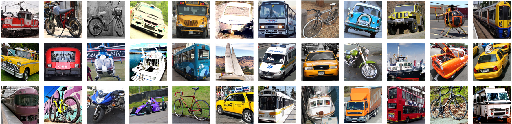

# Vehicle-10 dataset: Vehicle classification

[](https://www.gnu.org/licenses/old-licenses/gpl-2.0.en.html)

### Dataset Overview

The Vehicle-10 dataset foucuses on vehicle classification task. Specifically, we collected 30006 vehicle images from internet and divided them into 10 categories, e.g., bicycle, boat, bus, car, helicopter, minibus, motorcycle, minibus, taxi, train and truck. These images vary in resolution, ranging from 47pix × 36pix  to 4101pix × 2651pix. In the following, we give an example of different vehicle's images. 

<div align="center">
    
</div>

### Features

The size of training set includes 28804 images and the validation set consists of 7202 images. The label id and number of samples for each category are listed below: 

| Category   | bicycle | boat    | bus     | car     | helicopter | minibus | motorcycle | taxi    | train   | truck   |
| ------     | ----    | ------- | ------- | ------- | -------    | ------- | -------    | ------- | ------- | ------- |
| Label Id   | 0       | 1       |2        |3        |4           | 5       |6           |7        |8        |9        |
| Size       | 1618    | 8897    |4064     |8540     |668         |1477     |4438        |908      |1682     |3714     |

### Download

We also provide two data compression files for you to choose from: 

- Linux:  [vehicle-10.tar.gz](https://drive.google.com/file/d/1Z2LL-vcjKnpcX2rLyBkKG577mkPcYIpR/view?usp=sharing)

- Windows:  [vehicle-10.zip](https://drive.google.com/file/d/1pNmm9RjcdTJVRl8_uv-Cs5-CahkROKHs/view?usp=sharing)


After downloading and unzipping the above files, you can get the following directory structure. Concretely, The files named `train_meta.json` and `valid_meta.json` record the metadata of training set and validation set.

```
.
├── bicycle
├── boat
├── bus
├── car
├── helicopter
├── minibus
├── motorcycle
├── taxi
├── train
├── truck
├── train_meta.json
└── valid_meta.json
```

### Evaluation of Machine Learning

The evaluation code for the Vehicle-10 can be found in the `./src` directory. We briefly evaluated LeNet, ResNet (e.g., ResNet9, ResNet-18, ResNet-34, ResNet-50) and VGG (e.g., VGG-16, VGG-19) model architectures on Vehicle-10 dataset. Futhermore, we report the experimental results as following:

| Model  |[LetNet5](https://ieeexplore.ieee.org/abstract/document/6795724/) | [ResNet9](https://openaccess.thecvf.com/content_cvpr_2016/papers/He_Deep_Residual_Learning_CVPR_2016_paper.pdf) | [ResNet18](https://openaccess.thecvf.com/content_cvpr_2016/papers/He_Deep_Residual_Learning_CVPR_2016_paper.pdf)    | [ResNet34](https://openaccess.thecvf.com/content_cvpr_2016/papers/He_Deep_Residual_Learning_CVPR_2016_paper.pdf)     | [ResNet50](https://openaccess.thecvf.com/content_cvpr_2016/papers/He_Deep_Residual_Learning_CVPR_2016_paper.pdf)     | [VGG16](https://arxiv.org/pdf/1409.1556.pdf) | [VGG19](https://arxiv.org/pdf/1409.1556.pdf) | 
| ------  |----   | ----    | ------- | ------- | ------- | -------    | ------- | 
| Training Loss| 1.340  | 0.212    |0.385       |0.349        |0.624        |0.560         | 0.592       |
| Testing Loss| 1.492  | 1.093    |1.221       |1.297        |1.556        |1.081         | 1.281       |
| Accuracy| 51.125%  | 70.217%    |72.799%       |74.660%        |67.509%        |78.645%         | 77.951%       |

Traing parameters are epoch=50, batchsize=128 and img_size=224(for LeNet5 and ResNet9, img_size=32). Specifically, you can obtain the results by executing the scripts.

```
cd scripts/

sh ml_lenet5.sh
sh ml_resnet18.sh
sh ml_resnet34.sh
sh ml_vgg16.sh
sh ml_vgg19.sh
```


### Evaluation of Federated Learning

We also evaluated some popular federated algorithms (e.g., FedAvg, FedProx, FedNova) on Vehicle-10 dataset in Non-IID setting. Assumed that 100 clients participate in federation learning initiated by the server. In each communication round, the server selects 20% of the clients to participate in training process. We have the following results.

| Algorithm      | [FedAvg](https://proceedings.mlr.press/v54/mcmahan17a/mcmahan17a.pdf) | [FedProx](https://proceedings.mlsys.org/paper_files/paper/2020/file/1f5fe83998a09396ebe6477d9475ba0c-Paper.pdf)    | [FedNova](https://proceedings.neurips.cc/paper_files/paper/2020/file/564127c03caab942e503ee6f810f54fd-Paper.pdf) |
| ------     | ----    | ------- | ------- | 
| Accuracy   | 0       | 1       |2        |

You can run the scripts for the quickstart.
```
cd scripts/

sh fedavg.sh
sh fedprox.sh
sh fednova.sh
```

### Citation

If you find Vehicle-10 dataset to be useful in your own research, please consider citing the following paper:
```

```


### Acknowledgments

The Vehicle-10 dataset could not be collected without the following contributors. But we also do a lot of work on aligning and filtering for these scattered data.

- [5 vehichles for classification](https://www.kaggle.com/datasets/mrtontrnok/5-vehichles-for-multicategory-classification)

- [Vehicle Classification](https://www.kaggle.com/datasets/marquis03/vehicle-classification)

- [TAU Vehicle Type Recognition Competition](https://www.kaggle.com/competitions/vehicle/models)